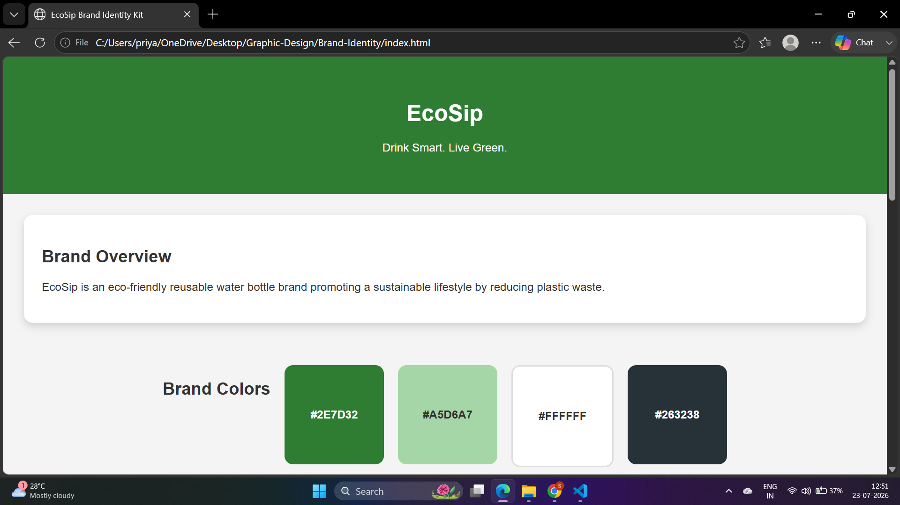
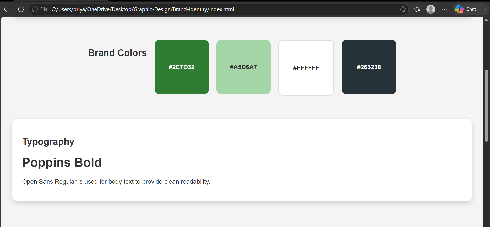
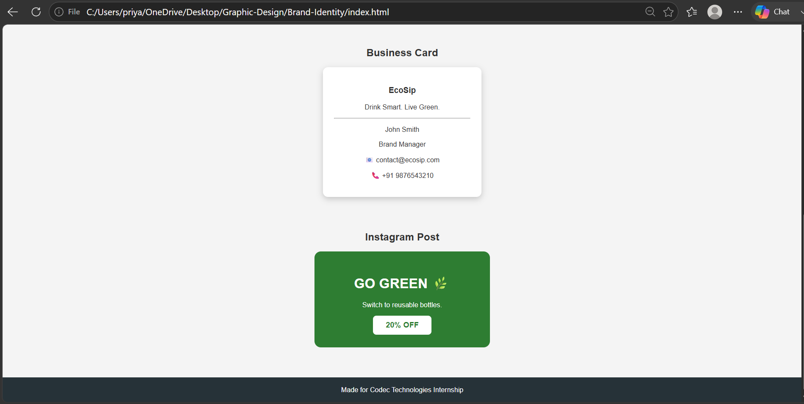

# 🎨 Brand Identity Kit – EcoSip

> A modern brand identity design project created using **HTML5** and **CSS3** for the **Codec Technologies Graphic Design Internship**.

---

## 🌐 Live Demo

🔗 **https://sonu-balagavi15.github.io/brand-identity-kit/**

---

## 📌 Project Overview

**EcoSip** is a fictional eco-friendly reusable water bottle brand that promotes sustainable living and reduces plastic waste. This project demonstrates the essential components of a complete brand identity system through a clean and responsive web design.

The project showcases branding elements including logo presentation, color palette, typography, business card, and a social media promotional post.

---

## ✨ Features

- 🌿 Brand Overview
- 🎨 Brand Color Palette
- 🔤 Typography Showcase
- 💳 Business Card Design
- 📱 Instagram Promotional Post
- 💻 Responsive Web Design
- ⚡ Clean and Modern User Interface

---

## 🛠️ Technologies Used

- HTML5
- CSS3
- SVG Graphics
- Visual Studio Code
- Git & GitHub
- GitHub Pages

---

## 📂 Project Structure

```
brand-identity-kit/
│
├── Brand-Identity/
│   ├── index.html
│   ├── style.css
│   ├── README.md
│   │
│   ├── assets/
│   │   └── logo.svg
│   │
│   └── screenshots/
│       ├── homepage.png
│       ├── brandpage.png
│       └── postpage.png
```

---

## 📸 Project Screenshots

### 🏠 Home Page



---

### 🎨 Brand Identity Section



---

### 📱 Instagram Promotional Post



---

## 🚀 Getting Started

### Clone the Repository

```bash
git clone https://github.com/sonu-balagavi15/brand-identity-kit.git
```

### Navigate to the Project Folder

```bash
cd brand-identity-kit/Brand-Identity
```

### Run the Project

Open **index.html** in your preferred web browser or use the **Live Server** extension in Visual Studio Code.

---

## 🎯 Learning Outcomes

- Understanding brand identity design principles
- Creating a responsive webpage using HTML and CSS
- Designing branding materials for a fictional company
- Organizing project files using Git and GitHub
- Deploying a static website using GitHub Pages

---

## 📋 Future Improvements

- Add a dark mode option
- Include more branding assets
- Improve responsiveness for all screen sizes
- Add smooth scrolling and interactive animations

---

## 👩‍💻 Author

**Sonu Parashuram Balagavi**

- 📧 Email: **sonubalagavi@gmail.com**
- 🐙 GitHub: **https://github.com/sonu-balagavi15**

---

## 📄 License

This project is developed for educational purposes and as part of the **Codec Technologies Graphic Design Internship**.

---

⭐ If you found this project useful, consider giving it a **star** on GitHub!
